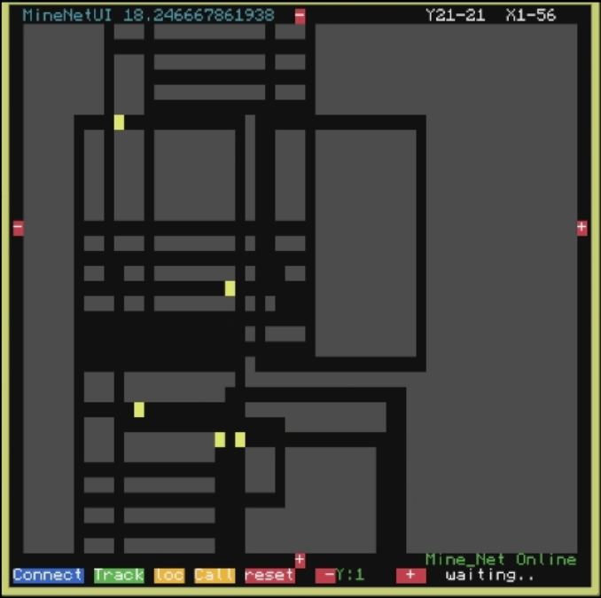
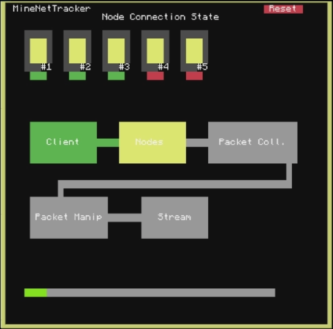

# MineNet-CC

MineNet-CC is a distributed networking framework built for [ComputerCraft / CC: Tweaked](https://tweaked.cc/) inside Minecraft.  
It provides a way to simulate real-world networking concepts like client–server communication, autonomous nodes, persistent data storage, and modular UI design — all within the sandbox environment of CC: Tweaked or CraftOS-PC.

---

##  Features
- **Client–Server Networking**  
  A master server (`MasterServer.lua`) coordinates and manages nodes across the network.

- **Autonomous Nodes**  
  Each node (`NodeMind.lua`) is capable of independent behavior while maintaining communication with the server.

- **Custom UI Framework**  
  Includes reusable UI components (`ui_lib.lua`, `mine_net_ui.lua`) for building interactive interfaces.

- **Scalability**  
  Built to handle unlimited number of nodes without code changes.

- **Persistence**  
  Custom database logic enables saving and retrieving state between sessions.
  
- **MaserServer.lua** 
  Core master server logic, runs as the entry point (startup.lua) on the master machine.

- **MasterMineUI.lua**
  The master server’s UI, handling visualization and control. Also used as a startup.lua.

- **mine_net.lua** 
  Core networking library. Provides message passing, channel setup, and network abstraction used by both server and nodes.

- **mine_net_ui.lua**
  UI helpers built specifically for MineNet, used by the server and monitoring tools to render networking information.

- **NodeMind.lua**
  Autonomous node logic. Acts as the node’s brain (startup.lua), maintaining communication with the master while performing independent behavior.

- **TMNL.lua**
  Terminal/node interaction script. Provides debugging and manual node control functionality.

- **ui_lib.lua** 
  General-purpose UI library. Provides reusable UI components (buttons, grids, event handling) for both MineNet and external projects.
---

##  Project Structure

```
Node*/
├── mine_net.lua         # Core networking library
├── NodeMind.lua         # Autonomous node logic - would be called startup.lua
├── TMNL.lua             # Terminal/node interaction logic

MasterServer/
├── MaserServer.lua      # Core server logic - would be called startup.lua
├── mine_net.lua         # Core networking library
├── mine_net_ui.lua      # Networking UI components
├── ui_lib.lua           # General-purpose UI library

MineNetUI/
├── MasterMineUI.lua     # Master server user interface - would be called startup.lua
├── mine_net.lua         # Core networking library
├── ui_lib.lua           # General-purpose UI library
```

---

##  Requirements

- Minecraft with [CC: Tweaked](https://tweaked.cc/) OR Computer Craft:OS [CraftOS-PC](https://www.craftos-pc.cc/)

##  Media

MineNet UI main interface currently tracking 5 nodes:



MineNet Master server, SCADA inspired realtime net flow tracking:



---

##  Contributing

Contributions, bug reports, and feature suggestions are welcome.  
If you’d like to contribute, please fork the repo and submit a pull request with clear documentation.
